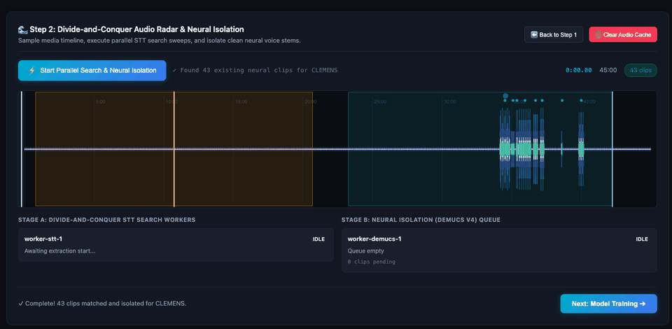
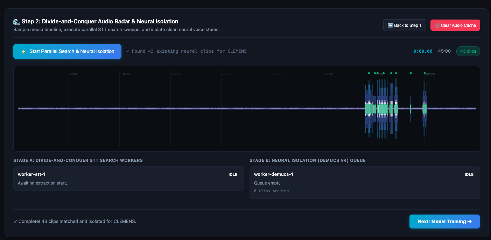
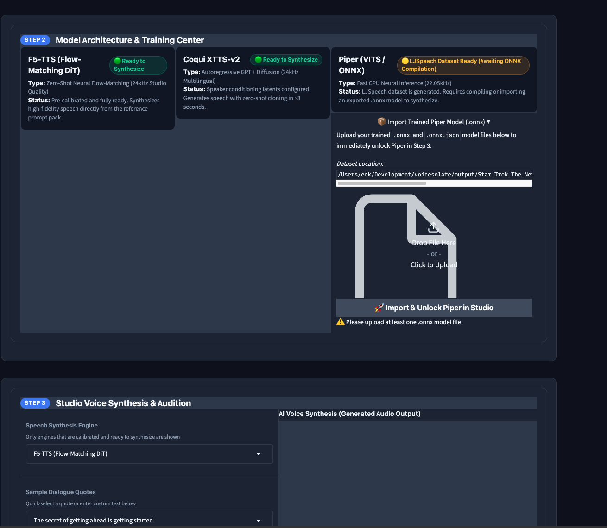
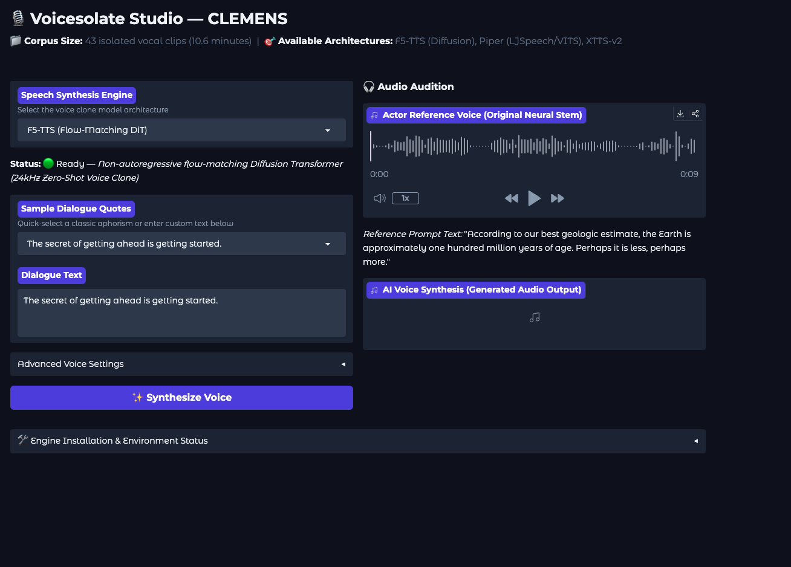
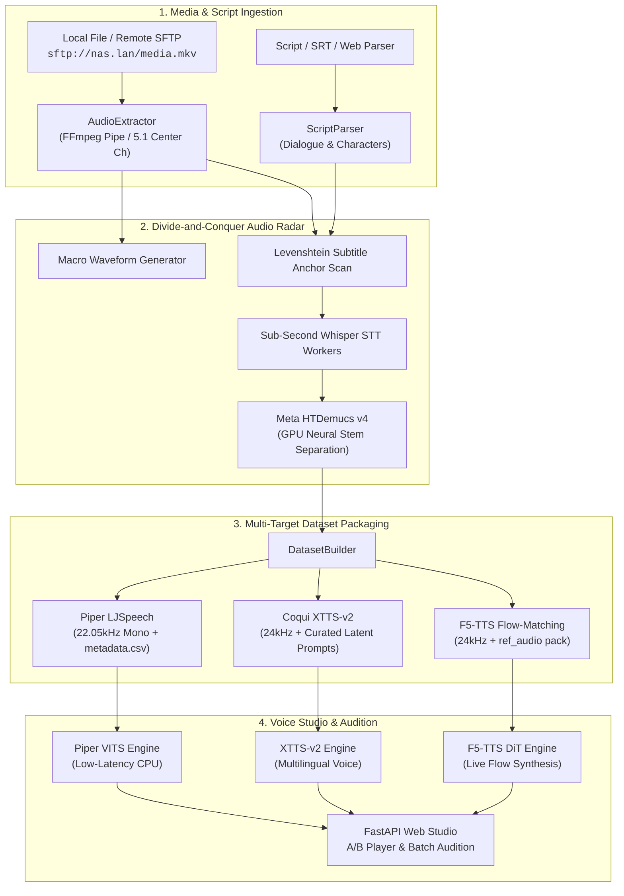

<div align="center">

# 🎙️ Voicesolate
### Automated Character Dialogue Isolation, Neural Stem Separation & Multi-Target TTS Voice Studio

[](https://www.python.org/)
[](https://fastapi.tiangolo.com/)
[](https://pytorch.org/)
[](https://developer.apple.com/metal/pytorch/)
[](https://opensource.org/licenses/MIT)
[](tests/)

**Transform any movie, TV episode, or audio mix into clean, production-ready AI voice clones in four automated steps.**

[Key Features](#-key-features) • [Remote SFTP Streaming](#-zero-download-remote-sftp--ssh-streaming) • [4-Step Studio Tour](#-interactive-voice-studio-tour) • [Architecture](#-system-architecture) • [Quickstart](#-quickstart--installation) • [CLI Reference](#-cli-reference)

---

</div>

## 🌟 Overview

**Voicesolate** is an end-to-end pipeline and web studio that extracts character speech directly from video or audio files (local disks or **remote SFTP/SSH storage**), aligns lines using whole-span fuzzy matching and sub-second Whisper word timestamps, isolates pristine vocal stems using GPU neural separation (Meta HTDemucs v4), aggregates multi-episode character corpora, and automatically compiles ready-to-train datasets and fine-tunes models for:

* **F5-TTS (Flow-Matching Non-Autoregressive DiT)**: Instant high-fidelity zero-shot voice cloning with live in-browser synthesis.
* **Piper (VITS / ONNX)**: Ultra-low latency CPU deployment for Home Assistant, edge hardware, and Raspberry Pi.
* **Coqui XTTS-v2 / Chatterbox**: 24kHz multilingual autoregressive cloning with automated reference prompt selection.

---

## ⚡ Zero-Download Remote SFTP / SSH Streaming

Voicesolate can process media **directly over remote SSH/SFTP storage without downloading multi-gigabyte video files to your local machine**. 

Using remote FFmpeg pipe streaming, Voicesolate queries video duration, probes audio streams, and seeks discrete dialogue chunks on demand over standard SSH keys:

```bash
# Process a 40GB 1080p/4K episode stored on your remote NAS without downloading it
voicesolate \
  -i "sftp://elijah@flanopticon.lan/mnt/nas/media/downloads/complete/TV Shows/Star Trek The Next Generation S06E01 Times Arrow Part 2 1080p AMZN WEB-DL DDP5 1 H 264-Kitsune/Star Trek The Next Generation S06E01 Times Arrow Part 2 1080p AMZN WEB-DL DDP5 1 H 264-Kitsune.mkv" \
  -c "CLEMENS"
```

* **No Storage Waste**: Avoid copying 15GB–50GB video files across your network.
* **Instant Start**: Begins probing audio timelines and sampling envelopes within seconds.
* **Discrete Front-Center Extraction**: Automatically extracts discrete dialogue channels (`FC`) from 5.1/7.1 surround tracks over the pipe with zero destructive phase cancellation.

---

## 🧭 Interactive Voice Studio Tour

Voicesolate includes a modern, high-performance web studio (`http://localhost:7860`) designed around an intuitive 4-step wizard:

### 1️⃣ Step 1: Media Ingestion & Screenplay Roster
* **Auto Episode Detection**: Automatically identifies season and episode codes (`S06E01`) from filenames.
* **Smart Screenplay Parser**: Queries script databases or parses embedded subtitles (`.srt`, `.ass`, `.txt`), extracting dialogue and filtering out parentheticals and stage directions.
* **Speaking Roster**: Displays all speaking characters sorted by line count with estimated speaking durations so you can immediately see which characters have enough audio for training.

---

### 2️⃣ Step 2: Divide-and-Conquer Audio Radar & Neural Isolation
* **Real-Time Audio Radar**: Visualizes the entire episode waveform envelope, RMS energy levels, and timecode intervals.
* **Multi-Worker Parallel Sweeps**: Spawns concurrent divide-and-conquer STT search workers across temporal chunks with animated laser scanning telemetry.
* **GPU Neural Isolation (Meta HTDemucs v4)**: Strips out background music, ambient sound effects, and score to produce studio-grade vocal stems.
* **A/B Waveform Inspector**: Audition the raw mixed audio versus the neural-isolated vocal stem for any dialogue line side-by-side before training.

<div align="center">
  
  <p><em>Live divide-and-conquer STT search workers scanning audio chunks and mapping dialogue clips onto the timeline radar.</em></p>
</div>

<div align="center">
  
  <p><em>43 neural-isolated clips identified, aligned, and isolated for Mark Twain (Clemens) with dual-stage worker queues.</em></p>
</div>

---

### 3️⃣ Step 3: Model Architecture & Training Center
* **Multi-Target Dataset Compilation**: Automatically formats audio files and manifests for Piper (22.05kHz mono LJSpeech), XTTS-v2 (24kHz speaker latents), and F5-TTS (24kHz DiT flow-matching).
* **Environment & Dependency Telemetry**: Real-time status badges detecting installed packages, GPU acceleration (Apple Silicon MPS / NVIDIA CUDA), and trainer CLIs.
* **Drag-and-Drop Model Import**: Directly upload pre-trained `.onnx` and `.onnx.json` model files to unlock instant inference.

<div align="center">
  
  <p><em>Step 3 Training Center displaying engine readiness, Piper LJSpeech compilation, and direct model importer.</em></p>
</div>

---

### 4️⃣ Step 4: Voice Synthesis Studio & Multi-Model Audition
* **Side-by-Side Audition**: Compare original actor reference stems against AI-synthesized voice generation with interactive audio players.
* **Script Quote Presets**: Quick-select classic character aphorisms and quotes or enter custom dialogue text.
* **Fine-Tuning Controls**: Real-time adjustments for Speech Speed, Random Seed, Classifier-Free Guidance (CFG Strength), and Flow-Matching DiT NFE steps.
* **Simultaneous Batch Audition**: Generate outputs across multiple engines at once to evaluate timbre, emotion, and accent retention.

<div align="center">
  
  <p><em>Step 4 Audition Studio with interactive waveform playback of the actor's original stem and live AI synthesis.</em></p>
</div>

---

## 🏗️ System Architecture



---

## 📁 Output Directory Structure

Voicesolate produces an organized, standard directory layout ready for immediate training or archival:

```text
output/<media_name>/
├── manifest.json                                   # Complete episode clip alignment manifest
└── <CHARACTER>/
    ├── raw/                                        # Discrete dialogue slices
    │   └── 00_00_35_915-00_00_36_855.wav
    ├── enhanced/                                   # Clean neural vocal masters (Demucs)
    │   └── 00_00_35_915-00_00_36_855_enhanced.wav
    ├── datasets/
    │   ├── piper/                                  # 22.05kHz mono LJSpeech dataset
    │   │   ├── metadata.csv                        # id|text|normalized_text
    │   │   ├── dataset.json
    │   │   └── wavs/
    │   ├── xtts/                                   # 24kHz Coqui XTTS-v2 dataset
    │   │   ├── metadata.csv                        # audio_path|text|speaker_name
    │   │   ├── reference_audio/                    # Curated 6-12s speaker audio prompts
    │   │   └── wavs/
    │   └── f5tts/                                  # 24kHz F5-TTS DiT dataset
    │       ├── metadata.csv                        # audio_path|transcript
    │       ├── ref_audio/                          # Optimal reference voice prompt (ref.wav + ref.txt)
    │       └── wavs/
    └── models/
        ├── piper/                                  # voice.onnx & voice.json model package
        ├── xtts/                                   # speaker_profile.json
        └── f5tts/                                  # f5_profile.json
```

---

## 🚀 Quickstart & Installation

### 1. Prerequisites
* **Python**: `>= 3.10`
* **FFmpeg**: Required for audio extraction and chunk seeking.
  ```bash
  # macOS (Homebrew)
  brew install ffmpeg

  # Ubuntu / Debian
  sudo apt-get update && sudo apt-get install -y ffmpeg
  ```

### 2. Install Voicesolate
```bash
# Clone repository
git clone https://github.com/axiomantic/voicesolate.git
cd voicesolate

# Create isolated environment with uv
uv venv
source .venv/bin/activate
uv pip install -e ".[test]"
```

### 3. Launch the Web Studio
```bash
# Starts FastAPI server with live WebSocket telemetry at http://localhost:7860
python3 -m voicesolate.server
```

---

## 💻 CLI Reference

```bash
# Basic local extraction with screenplay
voicesolate -i "path/to/movie.mkv" -s "path/to/screenplay.txt" -c "NEO"

# Remote SFTP zero-download extraction
voicesolate -i "sftp://user@host.lan/path/to/media.mkv" -c "CHARACTER"
```

| Flag | Description | Default |
| :--- | :--- | :--- |
| `-i, --input` | Path or SFTP/SSH URL to video or audio file | *(Required)* |
| `-c, --character` | Target character name(s) to export | Interactive prompt |
| `-s, --script` | Script path (`.txt`, `.json`, `.srt`), or URL | Auto-detected from subtitles |
| `--provider` | Script provider (e.g. `startrek`) | Auto-detect |
| `-o, --output-dir` | Directory where audio clips and manifest are saved | `./output` |
| `--targets` | TTS targets to prepare: `all`, `piper`, `xtts`, `f5` | `all` |
| `--min-duration` | Discard audio clips shorter than N seconds | `3.0` |
| `--no-train` | Prepare training-ready datasets only (skip tuning) | `False` |
| `--no-web-ui` | Skip launching the Voice Studio Web UI | `False` |
| `--no-aggregate` | Do not aggregate clips across multiple episodes | `False` (aggregates all) |
| `--no-enhance` | Skip neural Demucs isolation (export discrete raw slices) | `False` |
| `--no-cache-stt` | Bypass Whisper STT cache | `False` |
| `--no-cache-align` | Bypass sequence alignment cache | `False` |
| `--no-cache-audio` | Force re-slicing raw discrete audio from media source | `False` |
| `--no-cache-enhance`| Force re-running GPU Demucs isolation on slices | `False` |

---

## 🧪 Testing

Voicesolate includes a comprehensive unit and integration test suite executing under 1 second:

```bash
# Run all tests
uv run pytest

# Run unit tests only
uv run pytest -m unit

# Run integration tests only
uv run pytest -m integration
```

See [`tests/README.md`](tests/README.md) for full testing strategy, synthetic fixtures, and CI automation details.

---

## 📄 License

MIT License. See [LICENSE](LICENSE) for details.
